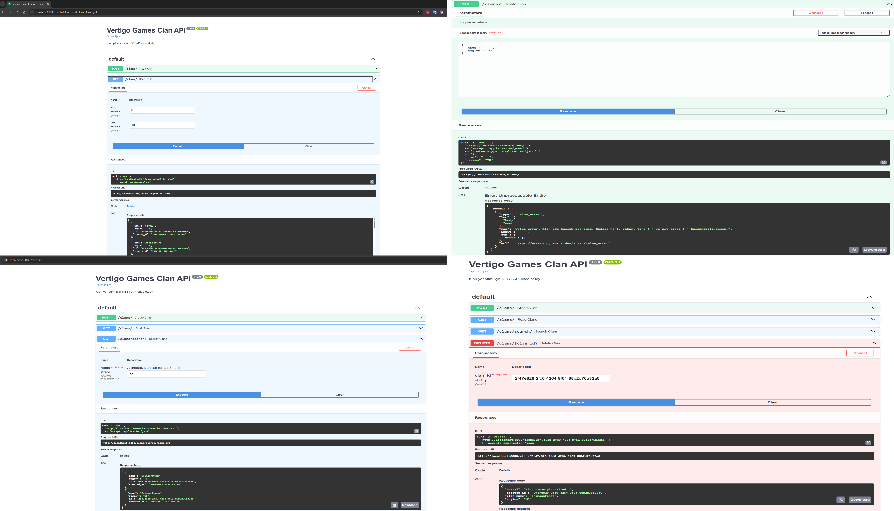
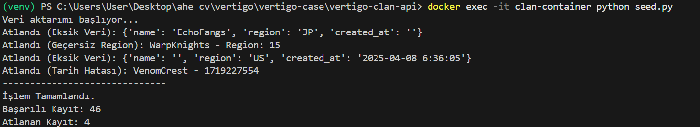

# Vertigo Games - Clan Backend API


Bu proje, Vertigo Games backend case study kapsamında geliştirilmiş, oyun klanlarını yönetmek için tasarlanmış, ölçeklenebilir ve dockerize edilmiş bir REST API servisidir.

## 📸 Ekran Görüntüleri

Projenin ait ekran görüntüleri aşağıdadır:

### 1. API Dokümantasyonu (Swagger UI)
API'nin tüm endpoint'leri Swagger arayüzü üzerinden test edilebilir.


### 2. Docker Konteyner Durumu
Proje Docker üzerinde başarıyla derlenmiş ve çalıştırılmıştır.

### 3. Veri Yükleme (Seeding)
Örnek veriler (CSV) başarıyla veritabanına işlenmiş ve API üzerinden erişilebilir hale gelmiştir.


---

## 🚀 Proje Hakkında

Oyun içi klanların oluşturulması, listelenmesi, aranması ve silinmesi işlemlerini yönetir. Google Cloud Run üzerinde çalışacak şekilde tasarlanmıştır ve Cloud SQL (PostgreSQL) entegrasyonuna sahiptir.

**Teknolojiler:**
* **Dil:** Python 3.9+
* **Framework:** FastAPI
* **Veritabanı:** PostgreSQL (Prod) / SQLite (Local/Docker)
* **ORM:** SQLAlchemy
* **Validasyon:** Pydantic (Özel Regex ve Enum kuralları ile)
* **Containerization:** Docker

---

## 📂 Proje Yapısı

```text
vertigo-clan-api/
├── app/
│   ├── main.py          # API Endpointleri
│   ├── models.py        # Veritabanı Modelleri
│   ├── schemas.py       # Pydantic Şemaları & Validasyon
│   ├── crud.py          # Veritabanı İşlemleri
│   └── database.py      # DB Bağlantı Ayarları
├── screenshots/         # Dokümantasyon görselleri
├── clan_sample_data.csv # Örnek veri seti
├── Dockerfile           # Konteyner tanımı
├── seed.py              # Veri yükleme scripti
└── requirements.txt     # Bağımlılıklar
```
## 🐳 Docker ile Kurulum ve Çalıştırma (Önerilen)

Projeyi herhangi bir Python kurulumuna ihtiyaç duymadan, izole bir konteyner içinde çalıştırmak için aşağıdaki adımları izleyin.

### 1. Gereksinimler
* Docker Desktop'ın bilgisayarınızda kurulu ve çalışıyor olması gerekmektedir.

### 2. İmajı Oluşturma (Build)
Terminali proje ana dizininde açın ve Docker imajını oluşturun:

```
docker build -t vertigo-clan-api .
```

### 3. Konteyneri Başlatma (Run)
Uygulamayı 8080 portunda arka planda çalıştırın:
```
docker run -d --name clan-container -p 8080:8080 vertigo-clan-api
```

### 4. Örnek Verileri Yükleme (Seeding)
Veritabanı konteyner içinde oluşturulduğunda başlangıçta boştur. clan_sample_data.csv dosyasındaki verileri veritabanına aktarmak için şu komutu çalıştırın:
```
docker exec -it clan-container python seed.py
```
(Çıktı olarak "İşlem Tamamlandı" ve yüklenen kayıt sayısını görmelisiniz.)

### 5. Test ve Dokümantasyon
Tarayıcınızda aşağıdaki adrese giderek Swagger UI üzerinden API'yi test edebilirsiniz:👉 http://localhost:8080/docs

### 6. Durdurma
Test işleminiz bittiğinde konteyneri durdurup silmek için:
```
docker stop clan-container
docker rm clan-container
```

## 📡 API Endpointleri

| Metot | Endpoint | Açıklama |
| :--- | :--- | :--- |
| **GET** | `/clans/` | Tüm klanları listeler (Pagination destekli). |
| **POST** | `/clans/` | Yeni bir klan oluşturur. (Validasyonlu). |
| **GET** | `/clans/search/` | İsme göre klan arar (Min 3 karakter). |
| **DELETE** | `/clans/{id}` | ID'si verilen klanı siler. |


---
**Author:** Ahmet Hakan Ekşi **Version:** v1.0

